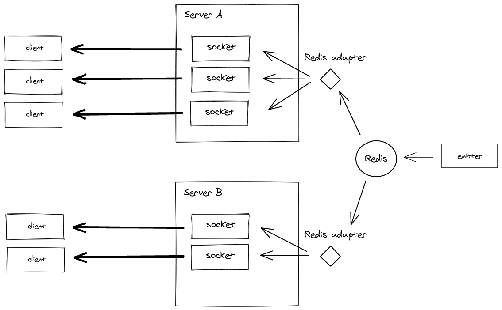

# The Socket.IO Redis emitter

[](https://github.com/socketio/socket.io-redis-emitter/actions)
[](https://www.npmjs.com/package/@socket.io/redis-emitter)

The `@socket.io/redis-emitter` package allows you to easily communicate with a group of Socket.IO servers from another Node.js process (server-side).



The emitter is also available in other programming languages:

- Java: https://github.com/sunsus/socket.io-java-emitter
- Python: https://pypi.org/project/socket.io-emitter/
- PHP: https://github.com/rase-/socket.io-php-emitter
- Golang: https://github.com/yosuke-furukawa/socket.io-go-emitter
- Perl: https://metacpan.org/pod/SocketIO::Emitter
- Rust: https://github.com/epli2/socketio-rust-emitter

It must be used in conjunction with [`@socket.io/redis-adapter`](https://github.com/socketio/socket.io-redis-adapter/).

The current version is compatible with both:

- `socket.io-redis@5` (`socket.io@2`)
- `socket.io-redis@6` (`socket.io@3` & `socket.io@4`)

## Table of content

- [How to use](#how-to-use)
  - [CommonJS](#commonjs)
  - [TypeScript](#typescript)
- [Emit cheatsheet](#emit-cheatsheet)
- [API](#api)
  - [Emitter(client[, opts])](#emitterclient-opts)
  - [Emitter#to(room)](#emittertoroomstringbroadcastoperator)
  - [Emitter#in(room)](#emitterinroomstringbroadcastoperator)
  - [Emitter#except(room)](#emitterexceptroomstringbroadcastoperator)
  - [Emitter#of(namespace)](#emitterofnamespacestringemitter)
  - [Emitter#socketsJoin()](#emittersocketsjoinroomsstringstring)
  - [Emitter#socketsLeave()](#emittersocketsleaveroomsstringstring)
  - [Emitter#disconnectSockets()](#emitterdisconnectsocketscloseboolean)
- [License](#license)

## How to use

### CommonJS

Installation: `npm i @socket.io/redis-emitter redis`

```js
const { Emitter } = require("@socket.io/redis-emitter");
const { createClient } = require("redis"); // not included, needs to be explicitly installed

const redisClient = createClient();
const io = new Emitter(redisClient);

setInterval(() => {
  io.emit("time", new Date);
}, 5000);
```

### TypeScript

Installation: `npm i @socket.io/redis-emitter redis @types/redis`

```ts
import { Emitter } from "@socket.io/redis-emitter";
import { createClient } from "redis";

const redisClient = createClient();
const io = new Emitter(redisClient);

setInterval(() => {
  io.emit("time", new Date);
}, 5000);
```

With typed events:

```ts
import { Emitter } from ".";
import { createClient } from "redis";

interface Events {
  basicEmit: (a: number, b: string, c: number[]) => void;
}

const redisClient = createClient();
const io = new Emitter<Events>(redisClient);

io.emit("basicEmit", 1, "2", [3]);
```

## Emit cheatsheet

```js
const { Emitter } = require("@socket.io/redis-emitter");
const { createClient } = require("redis"); // not included, needs to be explicitly installed

const redisClient = createClient();
const io = new Emitter(redisClient);

// sending to all clients
io.emit(/* ... */);

// sending to all clients in 'room1' room
io.to("room1").emit(/* ... */);

// sending to all clients in 'room1' except those in 'room2'
io.to("room1").except("room2").emit(/* ... */);

// sending to individual socketid (private message)
io.to(socketId).emit(/* ... */);

const nsp = io.of("/admin");

// sending to all clients in 'admin' namespace
nsp.emit(/* ... */);

// sending to all clients in 'admin' namespace and in 'notifications' room
nsp.to("notifications").emit(/* ... */);
```

**Note:** acknowledgements are not supported

## API

### Emitter(client[, opts])

`client` is a [node_redis](https://github.com/mranney/node_redis)
compatible client that has been initialized with the `return_buffers`
option set to `true`.

The following options are allowed:

- `key`: the name of the key to pub/sub events on as prefix (`socket.io`)

### Emitter#to(room:String):BroadcastOperator
### Emitter#in(room:String):BroadcastOperator

Specifies a specific `room` that you want to emit to.

### Emitter#except(room:String):BroadcastOperator

Specifies a specific `room` that you want to exclude from broadcasting.

### Emitter#of(namespace:String):Emitter

Specifies a specific namespace that you want to emit to.

### Emitter#socketsJoin(rooms:String|String[])

Makes the matching socket instances join the specified rooms:

```js
// make all Socket instances join the "room1" room
io.socketsJoin("room1");

// make all Socket instances of the "admin" namespace in the "room1" room join the "room2" room
io.of("/admin").in("room1").socketsJoin("room2");
```

### Emitter#socketsLeave(rooms:String|String[])

Makes the matching socket instances leave the specified rooms:

```js
// make all Socket instances leave the "room1" room
io.socketsLeave("room1");

// make all Socket instances of the "admin" namespace in the "room1" room leave the "room2" room
io.of("/admin").in("room1").socketsLeave("room2");
```

### Emitter#disconnectSockets(close:boolean)

Makes the matching socket instances disconnect:

```js
// make all Socket instances disconnect
io.disconnectSockets();

// make all Socket instances of the "admin" namespace in the "room1" room disconnect
io.of("/admin").in("room1").disconnectSockets();

// this also works with a single socket ID
io.of("/admin").in(theSocketId).disconnectSockets();
```

## License

MIT
